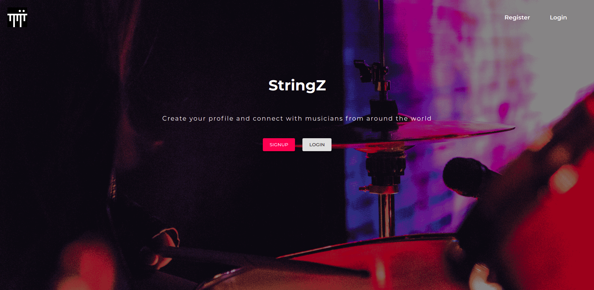
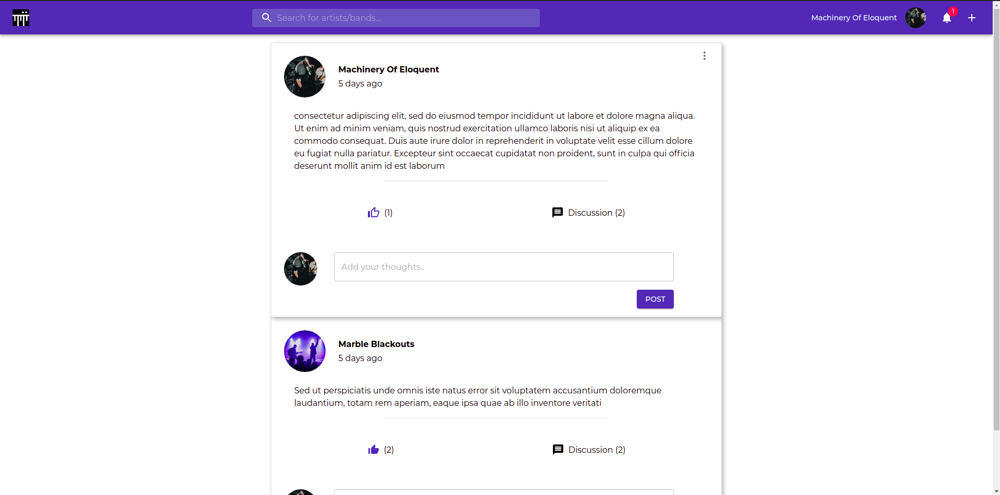
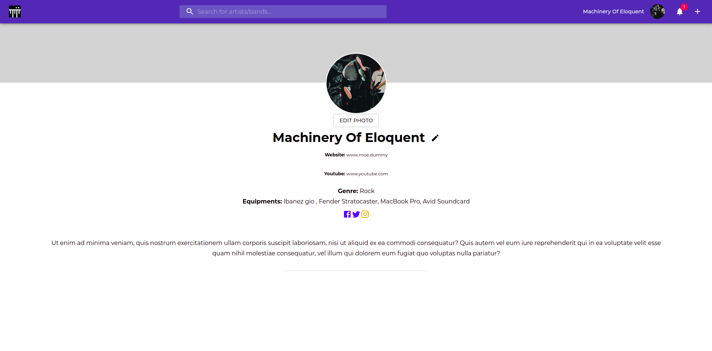
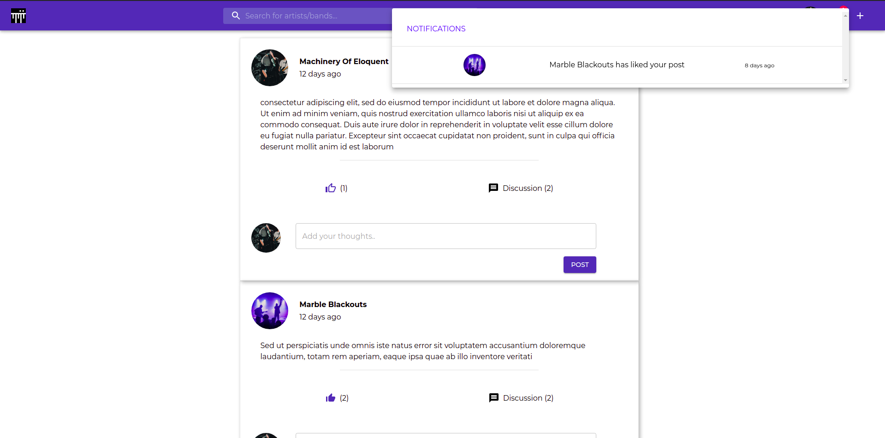
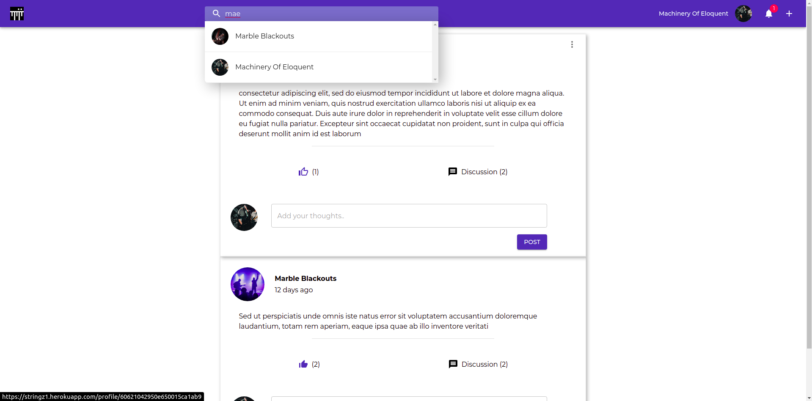

Live Site : [StringZ](https://stringz1.herokuapp.com)

# StringZ

StringZ is a social media app meant for musicians.

### `Technologies Used`

The web app was created from scratch using the technologies mentioned below:

- ##### Front-End:

  1. ReactJs
  2. Redux
  3. Material-UI

- ##### Back-End:

  1. NodeJs
  2. MongoDB (Cloud Atlas)
  3. Cloudinary (In the production build Cloudinary was used to host the images as Heroku does not allow write functionality on their servers.)

  ### `Features`

  Some of the features are given below:

  1. ##### User Posts

  

  Users can interact with posts. They can like a post or comment on it. They can also delete their own posts. A User can also click on the profile image on a post to directly go to that users profile.

  2. ##### Profile Page

  

  Users can create their profile on this page. They can also upload a profile picture of themselves or their band etc.

  3. ##### Notifications

  

  A notification system has also been impemented to notify the users when their post has been liked or commented on. Note: This is not a realtime notification system.

  4. ##### Search

  

  Users can search for other users by their artist or band names. This was done by the search index feature that is available in MongoDB Atlas. Users can then click on the artist/ band to visit their profile page.

  ### `Installation`

  1. Clone the project.
  2. Create a default.json file inside the config folder. Add mongoURI information and the jwtsecret inside the file. This is important, without the json file the app will fail to connect to mongoDB.
  3. Type in `npm install` to install all the dependencies.
  4. To start the app type in `npm run dev`. This will start both the server on localhost:5500 and the react app on localhost:3000.

  ### `After Thoughts`

  Only the core features of a social media app is present right now. More features will be added in the future. Some features which will definitely be added are:

  1. Realtime notification system and chat
  2. A 'follow' feature
